# Part-Based Concept AutoLabel

## Examples

### `people_in_a_park.png`


| | A place to sit | Khaki trousers | White jacket | Shoes |
|---|---|---|---|---|
| Saliency map | 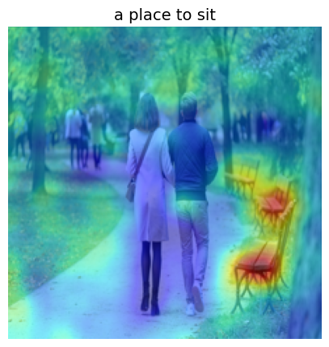 | 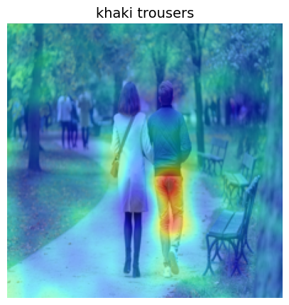 | 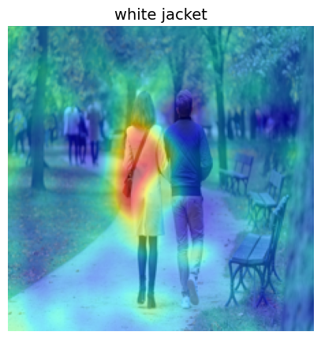 | 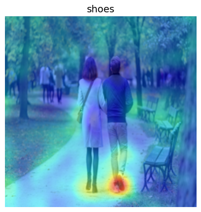 |
| Bounding box | 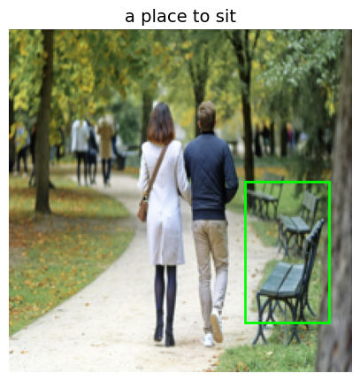 | 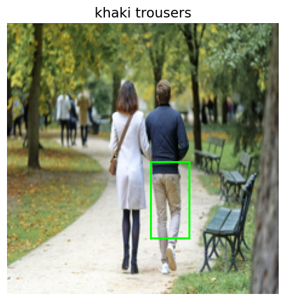 | 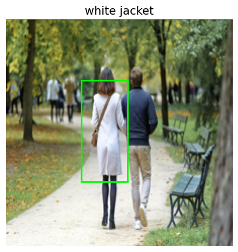 | 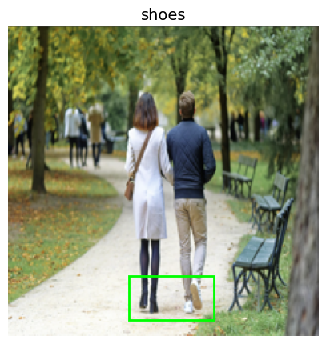 |

### `desk.png`


| | Shos the time | Something natural | Writing tools | Something to drink tea from |
|---|---|---|---|---|
| Saliency map | 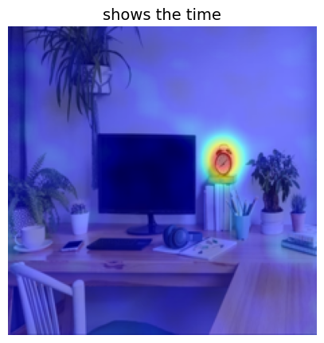 | 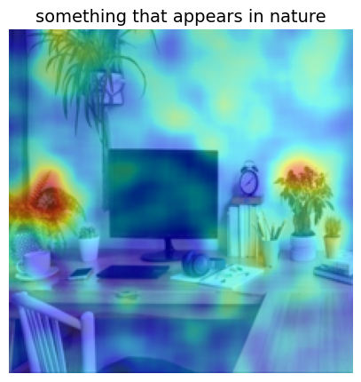 | 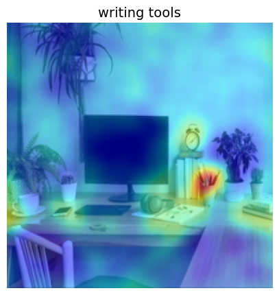 | 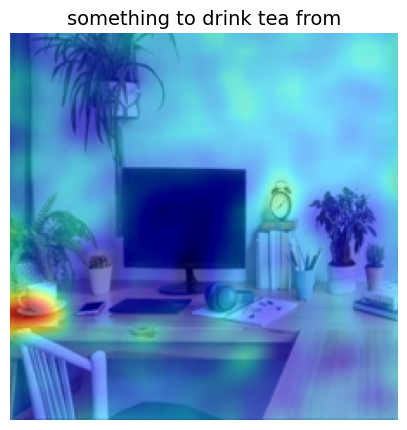 |
| Bounding box | 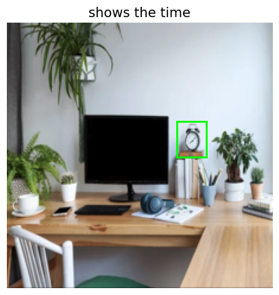 | 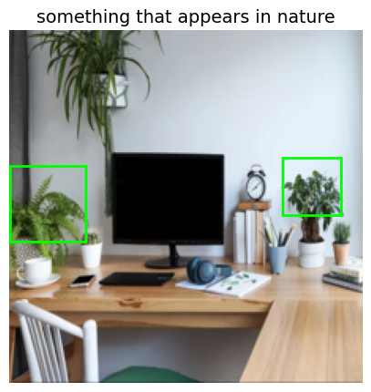 | 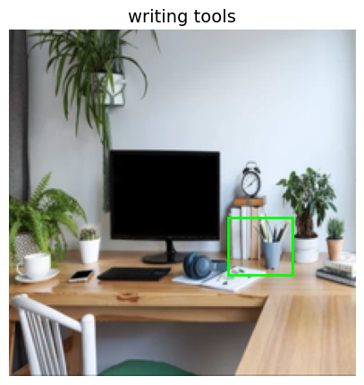 | 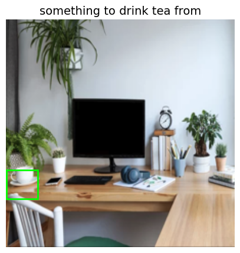 |

Concepts exist in all images, but having a model *locate* those concepts is non-trivial.

Label-free concept bottleneck models use image-text encoders to determine whether a concept is present in an image, in order to train interpretable classifiers. But *where* a concept exists in the image is an interesting question in its own right.

This code takes an image and a set of concepts and locates each concept within the image.

## How it works

It leverages [RISE](https://github.com/eclique/RISE) and image-text encoders (via [open_clip](https://github.com/mlfoundations/open_clip)) to:

1. Iteratively mask out random regions of the input image.
2. Measure how the presence of each concept changes when a given region is masked out.
3. Aggregate this over thousands of random masks to build a probability distribution over pixel locations — i.e. "this pixel has an X% chance of containing the target concept."
4. Attribute the densest region of pixels as the concept's location in the image.


## Running the code

```bash
python3 main.py --image <path_to_image> --concepts <concept1> <concept2> ...
```

| Argument | Description |
|---|---|
| `--image` | Path to the input image. |
| `--concepts` | Either a path to a `.txt` file containing concepts to localize, or a list of concept strings, e.g. `--concepts "a wheel" "a wing"`. |

### RISE parameters

These default values are tuned and a bit finicky — espically `p1` and `pre_upsample_size` so I would suggest leaving them as is.

| Argument | Description |
|---|---|
| `--p1` | Probability of populating a mask cell with a 1. |
| `--n_masks` | Number of random masks to apply to the input. More masks improve localization quality but increase runtime. |
| `--pre_upsample_size` | RISE first populates a low-res grid using `--p1`, then upsamples it to the image size. This sets the side length of that low-res grid. |

### Text-image encoder

The default model is SigLIP2, which is very accurate but large and slow. To see other available models, run:

```bash
python3 main.py --image none --concepts none --show_models
```

Once you've picked a model, set:

| Argument | Description |
|---|---|
| `--clip-model` | The model architecture to use. |
| `--pretrained` | The dataset the model was pretrained on. |

### Visualization

The script automatically generates a heatmap for each concept's location, plus bounding boxes around the concept.

| Argument | Description |
|---|---|
| `--n_boxes` | `auto` to auto-detect the number of boxes, or an integer `N` to find a fixed number of boxes. |
| `--box_threshold` | Value from 0–1; higher values make box detection more selective. |
| `--auto_box_rel_thresh` | Value from 0–1, used only when `--n_boxes auto`; higher values make the automatic box selection more selective. |

### Example command

```bash
python3 main.py --image desk.png --concepts "clock" "computer monitor" "potted plant" "something that appears in nature" "writing tools" "something to drink tea from"
```
